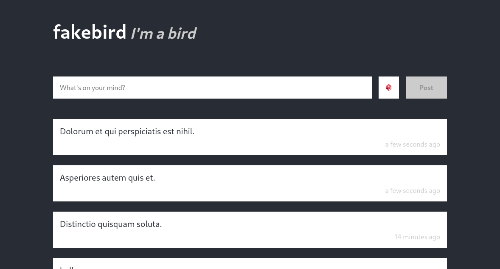

# fakebird

`fakebird` is a full stack application structured as follows:

- `./api/` contains a Flask application.
- `./db/` contains database migrations managed by `migrate/migrate`.
- `./docs/` contains some screenshots as supporting documentation.
- `./proxy/` contains an nginx configuration to manage the full application from
  the same origin.
- `./ui` contains a React application.

## Working with this dev environment

### Running the code

You should be able to run:

```bash
docker-compose up -d
```

And then navigate to http://localhost:8080/. You should see this in your
browser:



### Running the tests

To run the backend tests you can run:

```bash
docker-compose run --rm api-tester
```

This will run the backend test suite once, you can wrap this in a while loop or
customize your command to do debugging and such.

To run the frontend tests you can:

```bash
docker-compose run --rm ui-tester
```

This will run the react-jest test watcher so you can edit the frontend code and
affected tests will run every time you save!

### Accessing the containers

If you need to add dependencies or run debugging sessions in the different
environments you can do so by opening a shell in the target environment, using:

```bash
docker-compose run --rm ui bash
```

for the frontend environment and:

```bash
docker-compose run --rm api bash
```

for the backend environment.

If you feel comfortable peek at the `docker-compose.yaml` file to see what else
is possible.

### Rebuilding the environment

If you want to add dependencies by editing the respective manifest files
`package.json` or `requirements.txt` you'll need to rebuild your local images,
for that you can do:

```bash
docker-compose down
docker-compose build
docker-compose up -d
```

## Prompt

When you run this project and go to http://localhost:8080/, you're going to be
greeted by the _fakebird_ UI, it's a microblogging platform, totally not like
twitter. If your users create more than ten posts they're going to face a bit of
disapointment. As you can see for yourself, they're going to lose access to any
of the older posts.


From this start point you're asked to build two full stack features into the
system. First you need to build pagination so that fakebird users can see the
older posts in the page, second, you'll be building a feature to allow users to
delete posts.

### Pagination

The first feature you need to build in this project is pagination support:

- You'll need to implement pagination on the backend.
- Implement pagination on the frontend via a "load more" button at the end of
  the page.
- If you're familiar with intersection observers you can trigger the "load more"
  action once the user reaches the end of the page.
- Your pagination system needs to account for the case where you add more posts
  in a different tab and not show duplicate entries when you "load more". Cursor
  based pagination helps with this, but you can pick an implementation that
  would suit this use case.

Once pagination support is added users should be able to:

- Add more than ten posts.
- See older post beyond the 10 most recently created.
- Load the page without crashes if say a million posts have already been
  created.

### Post deletion

The second feature you need to implement is a way for users to **soft** delete
posts. Soft deleting means adding some version of a `deleted` field on the
database and ignoring any rows that have `deleted=True` instead of deleting the
rows out right. For this you'll need to follow these steps:

- Use the migration system to create the necessary database schema changes to
  accommodate soft delete.
- Implement a post delete endpoint.
- Make sure the post list/detail enpoints don't show deleted posts.
- Implement a button to delete posts in the frontend.

For both of these tasks there are test suites to support your work, but a
particular level of test coverage is not mandatory.
